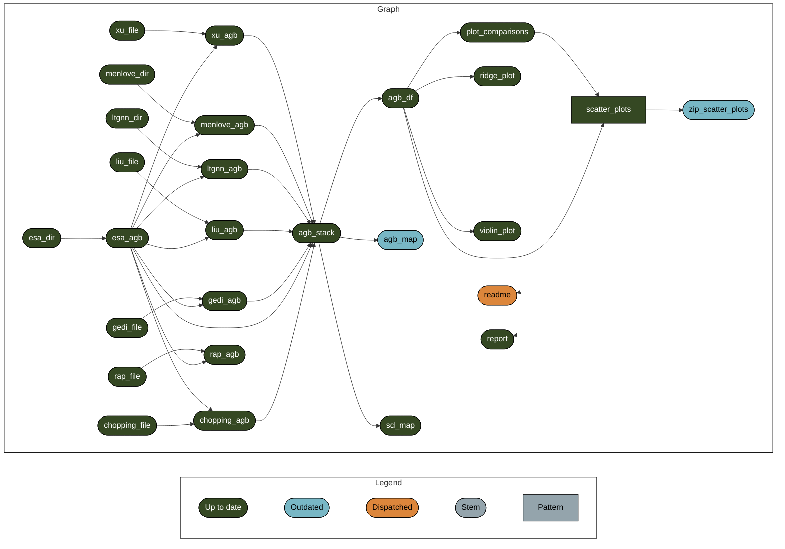

# AZ Carbon Stores Data Comparison


<!-- README.md is generated from README.qmd. Please edit that file -->
<!-- badges: start -->

[](https://www.repostatus.org/#wip)

<!-- badges: end -->

This is a research compendium for work in progress comparing estimates
of above-ground biomass in Arizona from different data products. This is
a collaboration between [CCT-Data
Science](https://datascience.cct.arizona.edu/) and the [David Moore
lab](https://djpmoore.tumblr.com/home) at University of Arizona.

## Reproducibility

<!--
### `renv`
&#10;This project uses [`renv`](https://rstudio.github.io/renv/articles/renv.html) for package management.
When opening this repo as an RStudio Project for the first time, `renv` should automatically install itself and prompt you to run `renv::restore()` to install all package dependencies.
-->

### `targets`

This project uses the [`targets`
package](https://docs.ropensci.org/targets/) for workflow management.
Run `targets::tar_make()` from the console to run the workflow and
reproduce all results. The graph below shows the workflow:

Warning message: package ‘tarchetypes’ was built under R version 4.3.2



## File structure

``` r
fs::dir_tree(recurse = 1)
```

    .
    ├── LICENSE
    ├── R
    │   ├── get_esa_crs.R
    │   ├── make_az_sf.R
    │   ├── plot_agb_map.R
    │   ├── plot_agb_ridges.R
    │   ├── plot_scatter.R
    │   ├── plot_sd_map.R
    │   ├── plot_violin.R
    │   ├── project_to_esa.R
    │   ├── read_clean_chopping.R
    │   ├── read_clean_esa.R
    │   ├── read_clean_gedi.R
    │   ├── read_clean_liu.R
    │   ├── read_clean_lt_gnn.R
    │   ├── read_clean_menlove.R
    │   ├── read_clean_rap.R
    │   ├── read_clean_xu.R
    │   └── trim_image.R
    ├── README.md
    ├── README.qmd
    ├── README.rmarkdown
    ├── SW_Biomass.Rproj
    ├── _targets
    │   ├── meta
    │   ├── objects
    │   └── user
    ├── _targets.R
    ├── data
    │   ├── rasters
    │   └── shapefiles
    ├── docs
    │   ├── _extensions
    │   ├── fig
    │   ├── report.html
    │   ├── report.qmd
    │   └── report_files
    ├── notes
    │   ├── improve ridges.R
    │   ├── kernel_estimation.R
    │   ├── mosaic_tiles.R
    │   ├── pointdensity_plots.R
    │   └── violin_plots.R
    ├── run.R
    ├── run.sh
    └── scatter.zip

- `R/` contains functions used in the `targets` pipeline.
- `_targets` is generated by `targets::tar_make()` and only the metadata
  of the targets pipeline is on GitHub.
- `_targets.R` defines a `targets` workflow
  <!-- -   `_targets_packages.R` is generated by `targets::tar_renv()` -->
- `data/rasters` is where data files for each of the data products
  should be placed in order to reproduce this workflow. More detailed
  instructions on what files are there TBD.
- `data/shapefiles` currently unused in workflow.
- `docs/` contains output figures and reports that are rendered.
- `notes/` contains scripts with “sketches” about how to do things
  <!-- -   `renv/` and `renv.lock` are necessary for the `renv` package to work (see above) -->
- `run.R` is for conveniently running `tar_make()` as a background job.
  Created by `targets::use_targets()`
