# AZ Carbon Stores Data Comparison


<!-- README.md is generated from README.qmd. Please edit that file -->
<!-- badges: start -->
[](https://www.repostatus.org/#inactive)

<!-- badges: end -->

This is a research compendium for a NASA CMS proposal comparing estimates
of above-ground biomass in Arizona from different data products. This is
a collaboration between [CCT-Data
Science](https://datascience.cct.arizona.edu/) and the [David Moore
lab](https://djpmoore.tumblr.com/home) at University of Arizona.

## Reproducibility

### `renv`

This project uses
[`renv`](https://rstudio.github.io/renv/articles/renv.html) for package
management. When opening this repo as an RStudio Project for the first
time, `renv` should automatically install itself and prompt you to run
`renv::restore()` to install all package dependencies.

### `targets`

This project uses the [`targets`
package](https://docs.ropensci.org/targets/) for workflow management.
Run `targets::tar_make()` from the console to run the workflow and
reproduce all results. The graph below shows the workflow:

Loading required namespace: terra

``` mermaid
graph LR
  style Legend fill:#FFFFFF00,stroke:#000000;
  style Graph fill:#FFFFFF00,stroke:#000000;
  subgraph Legend
    direction LR
    xf1522833a4d242c5([""Up to date""]):::uptodate --- x2db1ec7a48f65a9b([""Outdated""]):::outdated
    x2db1ec7a48f65a9b([""Outdated""]):::outdated --- xb6630624a7b3aa0f([""Dispatched""]):::dispatched
    xb6630624a7b3aa0f([""Dispatched""]):::dispatched --- xd03d7c7dd2ddda2b([""Stem""]):::none
    xd03d7c7dd2ddda2b([""Stem""]):::none --- x6f7e04ea3427f824[""Pattern""]:::none
  end
  subgraph Graph
    direction LR
    x0c544fc75086be79(["agb_stack"]):::uptodate --> x0af3feb37501f1f0(["agb_map_az_pdf<br>az pdf"]):::uptodate
    xd175b91b13bd123d(["az"]):::uptodate --> x0af3feb37501f1f0(["agb_map_az_pdf<br>az pdf"]):::uptodate
    xf66cf75dc2e3304d(["conus"]):::uptodate --> x20b6251b56892c2a(["esa_agb"]):::uptodate
    x151ce04cb638b59b(["esa_files"]):::uptodate --> x20b6251b56892c2a(["esa_agb"]):::uptodate
    x0c544fc75086be79(["agb_stack"]):::uptodate --> xbccfd088a963c01b(["median_map_ca_png<br>ca png"]):::uptodate
    xb65229902e01e989(["ca"]):::uptodate --> xbccfd088a963c01b(["median_map_ca_png<br>ca png"]):::uptodate
    x0c544fc75086be79(["agb_stack"]):::uptodate --> xa136827e6574e960(["sd_map_srer_png<br>srer png"]):::outdated
    x0838d78c836918b1(["srer"]):::uptodate --> xa136827e6574e960(["sd_map_srer_png<br>srer png"]):::outdated
    x0c544fc75086be79(["agb_stack"]):::uptodate --> x8fb024c3aab62b0a(["ridge_srer_png<br>png"]):::outdated
    x0838d78c836918b1(["srer"]):::uptodate --> x8fb024c3aab62b0a(["ridge_srer_png<br>png"]):::outdated
    x0c544fc75086be79(["agb_stack"]):::uptodate --> x1aa834f106e1d0d0(["agb_map_ca_pdf<br>ca pdf"]):::uptodate
    xb65229902e01e989(["ca"]):::uptodate --> x1aa834f106e1d0d0(["agb_map_ca_pdf<br>ca pdf"]):::uptodate
    xf66cf75dc2e3304d(["conus"]):::uptodate --> x9126df164c036a5c(["liu_agb"]):::uptodate
    x20b6251b56892c2a(["esa_agb"]):::uptodate --> x9126df164c036a5c(["liu_agb"]):::uptodate
    x19766d176d835c12(["liu_file"]):::uptodate --> x9126df164c036a5c(["liu_agb"]):::uptodate
    x0c544fc75086be79(["agb_stack"]):::uptodate --> xdc1de5d64600818c(["agb_map_pima_pdf<br>pima pdf"]):::outdated
    xc7806e6395dc77f0(["pima"]):::uptodate --> xdc1de5d64600818c(["agb_map_pima_pdf<br>pima pdf"]):::outdated
    x0c544fc75086be79(["agb_stack"]):::uptodate --> x5d46a426d10236f5(["sd_map_az_png<br>az png"]):::uptodate
    xd175b91b13bd123d(["az"]):::uptodate --> x5d46a426d10236f5(["sd_map_az_png<br>az png"]):::uptodate
    xf66cf75dc2e3304d(["conus"]):::uptodate --> xad3c233602b55f5e(["gedi_agb"]):::uptodate
    x20b6251b56892c2a(["esa_agb"]):::uptodate --> xad3c233602b55f5e(["gedi_agb"]):::uptodate
    x9ba8e1bb2da79809(["gedi_file"]):::uptodate --> xad3c233602b55f5e(["gedi_agb"]):::uptodate
    x56e33593de092521(["site_locs"]):::uptodate --> xf0a521e2ad8827d0(["sites_wide_csv"]):::uptodate
    x6d5be946c901f1fc(["sites_chopping_agb<br>chopping_agb"]):::uptodate --> xf0a521e2ad8827d0(["sites_wide_csv"]):::uptodate
    xdd5a1d9a1fcef4e4(["sites_esa_agb<br>esa_agb"]):::uptodate --> xf0a521e2ad8827d0(["sites_wide_csv"]):::uptodate
    x59d51c69de76369b(["sites_gedi_agb<br>gedi_agb"]):::uptodate --> xf0a521e2ad8827d0(["sites_wide_csv"]):::uptodate
    x12e2b32cf8941e93(["sites_liu_agb<br>liu_agb"]):::uptodate --> xf0a521e2ad8827d0(["sites_wide_csv"]):::uptodate
    xb55d23a3c1d98299(["sites_ltgnn_agb<br>ltgnn_agb"]):::uptodate --> xf0a521e2ad8827d0(["sites_wide_csv"]):::uptodate
    x723c460ba435f63e(["sites_menlove_agb<br>menlove_agb"]):::uptodate --> xf0a521e2ad8827d0(["sites_wide_csv"]):::uptodate
    xf0221f83c716da5d(["sites_xu_agb<br>xu_agb"]):::uptodate --> xf0a521e2ad8827d0(["sites_wide_csv"]):::uptodate
    x0c544fc75086be79(["agb_stack"]):::uptodate --> x80760e6101e4cb1d(["sd_map_srer_pdf<br>srer pdf"]):::outdated
    x0838d78c836918b1(["srer"]):::uptodate --> x80760e6101e4cb1d(["sd_map_srer_pdf<br>srer pdf"]):::outdated
    x0c544fc75086be79(["agb_stack"]):::uptodate --> x05a99b56c623bdbf(["median_map_pima_png<br>pima png"]):::outdated
    xc7806e6395dc77f0(["pima"]):::uptodate --> x05a99b56c623bdbf(["median_map_pima_png<br>pima png"]):::outdated
    x693953566a2ca630(["agb_df_az"]):::uptodate --> x2d046568113c38ec["scatter_plots"]:::outdated
    xfe340e9d3143cfe1(["plot_comparisons"]):::outdated --> x2d046568113c38ec["scatter_plots"]:::outdated
    x434f37652a8b2dac(["menlove_agb"]):::uptodate --> x723c460ba435f63e(["sites_menlove_agb<br>menlove_agb"]):::uptodate
    x56e33593de092521(["site_locs"]):::uptodate --> x723c460ba435f63e(["sites_menlove_agb<br>menlove_agb"]):::uptodate
    x0c544fc75086be79(["agb_stack"]):::uptodate --> x6f9571f76fb08c01(["sd_map_ca_png<br>ca png"]):::uptodate
    xb65229902e01e989(["ca"]):::uptodate --> x6f9571f76fb08c01(["sd_map_ca_png<br>ca png"]):::uptodate
    x34fa7583752e3167(["chopping_file"]):::uptodate --> xf4e158caecdccb15(["chopping_agb"]):::uptodate
    xf66cf75dc2e3304d(["conus"]):::uptodate --> xf4e158caecdccb15(["chopping_agb"]):::uptodate
    x20b6251b56892c2a(["esa_agb"]):::uptodate --> xf4e158caecdccb15(["chopping_agb"]):::uptodate
    x0c544fc75086be79(["agb_stack"]):::uptodate --> x8fdb741d59a9d9f7(["agb_map_pima_png<br>pima png"]):::outdated
    xc7806e6395dc77f0(["pima"]):::uptodate --> x8fdb741d59a9d9f7(["agb_map_pima_png<br>pima png"]):::outdated
    x0c544fc75086be79(["agb_stack"]):::uptodate --> xcb744cc5b3c011de(["median_map_az_png<br>az png"]):::uptodate
    xd175b91b13bd123d(["az"]):::uptodate --> xcb744cc5b3c011de(["median_map_az_png<br>az png"]):::uptodate
    x0c544fc75086be79(["agb_stack"]):::uptodate --> x9db81f788ddc3e77(["ridge_az_png<br>png"]):::uptodate
    xd175b91b13bd123d(["az"]):::uptodate --> x9db81f788ddc3e77(["ridge_az_png<br>png"]):::uptodate
    x0c544fc75086be79(["agb_stack"]):::uptodate --> x0838d78c836918b1(["srer"]):::uptodate
    xf2a8a94e15c1f5bb(["srer_dir"]):::uptodate --> x0838d78c836918b1(["srer"]):::uptodate
    x0c544fc75086be79(["agb_stack"]):::uptodate --> x9026d3689638e855(["ridge_pima_png<br>png"]):::outdated
    xc7806e6395dc77f0(["pima"]):::uptodate --> x9026d3689638e855(["ridge_pima_png<br>png"]):::outdated
    x0c544fc75086be79(["agb_stack"]):::uptodate --> x870b061d4d3330a9(["median_map_ca_pdf<br>ca pdf"]):::uptodate
    xb65229902e01e989(["ca"]):::uptodate --> x870b061d4d3330a9(["median_map_ca_pdf<br>ca pdf"]):::uptodate
    xad3c233602b55f5e(["gedi_agb"]):::uptodate --> x59d51c69de76369b(["sites_gedi_agb<br>gedi_agb"]):::uptodate
    x56e33593de092521(["site_locs"]):::uptodate --> x59d51c69de76369b(["sites_gedi_agb<br>gedi_agb"]):::uptodate
    xd175b91b13bd123d(["az"]):::uptodate --> xe11d03c8a0dcbd3e(["subsets"]):::outdated
    xb65229902e01e989(["ca"]):::uptodate --> xe11d03c8a0dcbd3e(["subsets"]):::outdated
    xc7806e6395dc77f0(["pima"]):::uptodate --> xe11d03c8a0dcbd3e(["subsets"]):::outdated
    x0838d78c836918b1(["srer"]):::uptodate --> xe11d03c8a0dcbd3e(["subsets"]):::outdated
    x0c544fc75086be79(["agb_stack"]):::uptodate --> x6ded25abd13901dd(["agb_map_srer_png<br>srer png"]):::outdated
    x0838d78c836918b1(["srer"]):::uptodate --> x6ded25abd13901dd(["agb_map_srer_png<br>srer png"]):::outdated
    x982c4ea78b58d1bb(["ca_az"]):::uptodate --> x0c544fc75086be79(["agb_stack"]):::uptodate
    xf4e158caecdccb15(["chopping_agb"]):::uptodate --> x0c544fc75086be79(["agb_stack"]):::uptodate
    x20b6251b56892c2a(["esa_agb"]):::uptodate --> x0c544fc75086be79(["agb_stack"]):::uptodate
    xad3c233602b55f5e(["gedi_agb"]):::uptodate --> x0c544fc75086be79(["agb_stack"]):::uptodate
    x9126df164c036a5c(["liu_agb"]):::uptodate --> x0c544fc75086be79(["agb_stack"]):::uptodate
    xf99622c5fc8ef45a(["ltgnn_agb"]):::uptodate --> x0c544fc75086be79(["agb_stack"]):::uptodate
    x434f37652a8b2dac(["menlove_agb"]):::uptodate --> x0c544fc75086be79(["agb_stack"]):::uptodate
    x55cd1a25824d6c45(["xu_agb"]):::uptodate --> x0c544fc75086be79(["agb_stack"]):::uptodate
    xd15cf4874a3c1896(["neon_field_path"]):::uptodate --> x56e33593de092521(["site_locs"]):::uptodate
    x17e6721300ec7ca6(["neon_kmz"]):::uptodate --> x56e33593de092521(["site_locs"]):::uptodate
    x0c544fc75086be79(["agb_stack"]):::uptodate --> xbe39f12168f1b406(["sd_map_az_pdf<br>az pdf"]):::uptodate
    xd175b91b13bd123d(["az"]):::uptodate --> xbe39f12168f1b406(["sd_map_az_pdf<br>az pdf"]):::uptodate
    xf66cf75dc2e3304d(["conus"]):::uptodate --> x55cd1a25824d6c45(["xu_agb"]):::uptodate
    x20b6251b56892c2a(["esa_agb"]):::uptodate --> x55cd1a25824d6c45(["xu_agb"]):::uptodate
    x4f83a8bb6986eb55(["xu_file"]):::uptodate --> x55cd1a25824d6c45(["xu_agb"]):::uptodate
    x0c544fc75086be79(["agb_stack"]):::uptodate --> x98aa47b23555b2af(["sd_map_pima_pdf<br>pima pdf"]):::outdated
    xc7806e6395dc77f0(["pima"]):::uptodate --> x98aa47b23555b2af(["sd_map_pima_pdf<br>pima pdf"]):::outdated
    x0c544fc75086be79(["agb_stack"]):::uptodate --> x1057db013368d12d(["median_map_pima_pdf<br>pima pdf"]):::outdated
    xc7806e6395dc77f0(["pima"]):::uptodate --> x1057db013368d12d(["median_map_pima_pdf<br>pima pdf"]):::outdated
    x0c544fc75086be79(["agb_stack"]):::uptodate --> xb9c1d12e637f675e(["median_map_srer_pdf<br>srer pdf"]):::outdated
    x0838d78c836918b1(["srer"]):::uptodate --> xb9c1d12e637f675e(["median_map_srer_pdf<br>srer pdf"]):::outdated
    xf99622c5fc8ef45a(["ltgnn_agb"]):::uptodate --> xb55d23a3c1d98299(["sites_ltgnn_agb<br>ltgnn_agb"]):::uptodate
    x56e33593de092521(["site_locs"]):::uptodate --> xb55d23a3c1d98299(["sites_ltgnn_agb<br>ltgnn_agb"]):::uptodate
    x0c544fc75086be79(["agb_stack"]):::uptodate --> x99b6ef97d01b006a(["sd_map_ca_pdf<br>ca pdf"]):::uptodate
    xb65229902e01e989(["ca"]):::uptodate --> x99b6ef97d01b006a(["sd_map_ca_pdf<br>ca pdf"]):::uptodate
    x20b6251b56892c2a(["esa_agb"]):::uptodate --> xdd5a1d9a1fcef4e4(["sites_esa_agb<br>esa_agb"]):::uptodate
    x56e33593de092521(["site_locs"]):::uptodate --> xdd5a1d9a1fcef4e4(["sites_esa_agb<br>esa_agb"]):::uptodate
    x9126df164c036a5c(["liu_agb"]):::uptodate --> x12e2b32cf8941e93(["sites_liu_agb<br>liu_agb"]):::uptodate
    x56e33593de092521(["site_locs"]):::uptodate --> x12e2b32cf8941e93(["sites_liu_agb<br>liu_agb"]):::uptodate
    xf66cf75dc2e3304d(["conus"]):::uptodate --> x434f37652a8b2dac(["menlove_agb"]):::uptodate
    x20b6251b56892c2a(["esa_agb"]):::uptodate --> x434f37652a8b2dac(["menlove_agb"]):::uptodate
    xb2d478ff7b617081(["menlove_dir"]):::uptodate --> x434f37652a8b2dac(["menlove_agb"]):::uptodate
    x0c544fc75086be79(["agb_stack"]):::uptodate --> x494a8da183e6456e(["ridge_ca_png<br>png"]):::uptodate
    xb65229902e01e989(["ca"]):::uptodate --> x494a8da183e6456e(["ridge_ca_png<br>png"]):::uptodate
    x0c544fc75086be79(["agb_stack"]):::uptodate --> xa873944eb0f3630d(["median_map_az_pdf<br>az pdf"]):::uptodate
    xd175b91b13bd123d(["az"]):::uptodate --> xa873944eb0f3630d(["median_map_az_pdf<br>az pdf"]):::uptodate
    x0c544fc75086be79(["agb_stack"]):::uptodate --> x67bb6dac1619a9fe(["agb_map_az_png<br>az png"]):::uptodate
    xd175b91b13bd123d(["az"]):::uptodate --> x67bb6dac1619a9fe(["agb_map_az_png<br>az png"]):::uptodate
    x0c544fc75086be79(["agb_stack"]):::uptodate --> xd175b91b13bd123d(["az"]):::uptodate
    x0c544fc75086be79(["agb_stack"]):::uptodate --> x599ce45254dfcf12(["median_map_srer_png<br>srer png"]):::outdated
    x0838d78c836918b1(["srer"]):::uptodate --> x599ce45254dfcf12(["median_map_srer_png<br>srer png"]):::outdated
    x0c544fc75086be79(["agb_stack"]):::uptodate --> xfcb3304ed0ccad58(["agb_map_ca_png<br>ca png"]):::outdated
    xb65229902e01e989(["ca"]):::uptodate --> xfcb3304ed0ccad58(["agb_map_ca_png<br>ca png"]):::outdated
    xf4e158caecdccb15(["chopping_agb"]):::uptodate --> x6d5be946c901f1fc(["sites_chopping_agb<br>chopping_agb"]):::uptodate
    x56e33593de092521(["site_locs"]):::uptodate --> x6d5be946c901f1fc(["sites_chopping_agb<br>chopping_agb"]):::uptodate
    x0c544fc75086be79(["agb_stack"]):::uptodate --> x1df925585a964a4f["summary_stats"]:::outdated
    xe11d03c8a0dcbd3e(["subsets"]):::outdated --> x1df925585a964a4f["summary_stats"]:::outdated
    x0c544fc75086be79(["agb_stack"]):::uptodate --> x7ad56487cc88740a(["agb_map_srer_pdf<br>srer pdf"]):::outdated
    x0838d78c836918b1(["srer"]):::uptodate --> x7ad56487cc88740a(["agb_map_srer_pdf<br>srer pdf"]):::outdated
    x0c544fc75086be79(["agb_stack"]):::uptodate --> xb65229902e01e989(["ca"]):::uptodate
    x56e33593de092521(["site_locs"]):::uptodate --> xf0221f83c716da5d(["sites_xu_agb<br>xu_agb"]):::uptodate
    x55cd1a25824d6c45(["xu_agb"]):::uptodate --> xf0221f83c716da5d(["sites_xu_agb<br>xu_agb"]):::uptodate
    x67bb6dac1619a9fe(["agb_map_az_png<br>az png"]):::uptodate --> xb72891f20a5b8df1(["report"]):::outdated
    xfcb3304ed0ccad58(["agb_map_ca_png<br>ca png"]):::outdated --> xb72891f20a5b8df1(["report"]):::outdated
    x8fdb741d59a9d9f7(["agb_map_pima_png<br>pima png"]):::outdated --> xb72891f20a5b8df1(["report"]):::outdated
    x6ded25abd13901dd(["agb_map_srer_png<br>srer png"]):::outdated --> xb72891f20a5b8df1(["report"]):::outdated
    xcb744cc5b3c011de(["median_map_az_png<br>az png"]):::uptodate --> xb72891f20a5b8df1(["report"]):::outdated
    xbccfd088a963c01b(["median_map_ca_png<br>ca png"]):::uptodate --> xb72891f20a5b8df1(["report"]):::outdated
    x05a99b56c623bdbf(["median_map_pima_png<br>pima png"]):::outdated --> xb72891f20a5b8df1(["report"]):::outdated
    x599ce45254dfcf12(["median_map_srer_png<br>srer png"]):::outdated --> xb72891f20a5b8df1(["report"]):::outdated
    x9db81f788ddc3e77(["ridge_az_png<br>png"]):::uptodate --> xb72891f20a5b8df1(["report"]):::outdated
    x494a8da183e6456e(["ridge_ca_png<br>png"]):::uptodate --> xb72891f20a5b8df1(["report"]):::outdated
    x9026d3689638e855(["ridge_pima_png<br>png"]):::outdated --> xb72891f20a5b8df1(["report"]):::outdated
    x8fb024c3aab62b0a(["ridge_srer_png<br>png"]):::outdated --> xb72891f20a5b8df1(["report"]):::outdated
    x2d046568113c38ec["scatter_plots"]:::outdated --> xb72891f20a5b8df1(["report"]):::outdated
    x5d46a426d10236f5(["sd_map_az_png<br>az png"]):::uptodate --> xb72891f20a5b8df1(["report"]):::outdated
    x6f9571f76fb08c01(["sd_map_ca_png<br>ca png"]):::uptodate --> xb72891f20a5b8df1(["report"]):::outdated
    x65d586cb69f78e35(["sd_map_pima_png<br>pima png"]):::outdated --> xb72891f20a5b8df1(["report"]):::outdated
    xa136827e6574e960(["sd_map_srer_png<br>srer png"]):::outdated --> xb72891f20a5b8df1(["report"]):::outdated
    x1df925585a964a4f["summary_stats"]:::outdated --> xb72891f20a5b8df1(["report"]):::outdated
    x0c544fc75086be79(["agb_stack"]):::uptodate --> x693953566a2ca630(["agb_df_az"]):::uptodate
    xd175b91b13bd123d(["az"]):::uptodate --> x693953566a2ca630(["agb_df_az"]):::uptodate
    x2d046568113c38ec["scatter_plots"]:::outdated --> x1cedc3c7f523e7cc(["zip_scatter_plots"]):::outdated
    x693953566a2ca630(["agb_df_az"]):::uptodate --> xfe340e9d3143cfe1(["plot_comparisons"]):::outdated
    xf66cf75dc2e3304d(["conus"]):::uptodate --> xf99622c5fc8ef45a(["ltgnn_agb"]):::uptodate
    x20b6251b56892c2a(["esa_agb"]):::uptodate --> xf99622c5fc8ef45a(["ltgnn_agb"]):::uptodate
    x00f89745e3b925a1(["ltgnn_files"]):::uptodate --> xf99622c5fc8ef45a(["ltgnn_agb"]):::uptodate
    x0c544fc75086be79(["agb_stack"]):::uptodate --> x65d586cb69f78e35(["sd_map_pima_png<br>pima png"]):::outdated
    xc7806e6395dc77f0(["pima"]):::uptodate --> x65d586cb69f78e35(["sd_map_pima_png<br>pima png"]):::outdated
    x0c544fc75086be79(["agb_stack"]):::uptodate --> xc7806e6395dc77f0(["pima"]):::uptodate
    x7df2044a2dc501ea(["pima_dir"]):::uptodate --> xc7806e6395dc77f0(["pima"]):::uptodate
    xc11069275cfeb620(["readme"]):::dispatched --> xc11069275cfeb620(["readme"]):::dispatched
  end
  classDef uptodate stroke:#000000,color:#ffffff,fill:#354823;
  classDef outdated stroke:#000000,color:#000000,fill:#78B7C5;
  classDef dispatched stroke:#000000,color:#000000,fill:#DC863B;
  classDef none stroke:#000000,color:#000000,fill:#94a4ac;
  linkStyle 0 stroke-width:0px;
  linkStyle 1 stroke-width:0px;
  linkStyle 2 stroke-width:0px;
  linkStyle 3 stroke-width:0px;
  linkStyle 148 stroke-width:0px;
```



## File structure

``` r
fs::dir_tree(recurse = 1)
```

    .
    ├── LICENSE
    ├── R
    │   ├── calc_summary.R
    │   ├── crop_srer.R
    │   ├── extract_agb_site.R
    │   ├── get_esa_crs.R
    │   ├── get_site_locs.R
    │   ├── make_agb_stack.R
    │   ├── make_az_sf.R
    │   ├── make_ca_az_sf.R
    │   ├── make_shape_list.R
    │   ├── pivot_sites.R
    │   ├── plot_agb_map.R
    │   ├── plot_agb_ridges.R
    │   ├── plot_median_map.R
    │   ├── plot_scatter.R
    │   ├── plot_sd_map.R
    │   ├── project_crop_esa.R
    │   ├── read_clean_chopping.R
    │   ├── read_clean_esa.R
    │   ├── read_clean_gedi.R
    │   ├── read_clean_liu.R
    │   ├── read_clean_lt_gnn.R
    │   ├── read_clean_menlove.R
    │   ├── read_clean_rap.R
    │   ├── read_clean_xu.R
    │   ├── trim_image.R
    │   └── zip_plots.R
    ├── README.md
    ├── README.qmd
    ├── README.rmarkdown
    ├── SW_Biomass.Rproj
    ├── _targets
    │   ├── meta
    │   ├── objects
    │   ├── scratch
    │   └── user
    ├── _targets.R
    ├── _targets_packages.R
    ├── data
    │   ├── rasters
    │   └── shapefiles
    ├── docs
    │   ├── fig
    │   ├── report.html
    │   ├── report.qmd
    │   ├── report_files
    │   ├── site_data.csv
    │   └── xu_trend.png
    ├── notes
    │   ├── NEON_data.png
    │   ├── ameriflux.R
    │   ├── estimate_file_sizes.R
    │   ├── improve ridges.R
    │   ├── kernel_estimation.R
    │   ├── mosaic_tiles.R
    │   ├── neon_usfs_data.R
    │   ├── plot_doy_trends.R
    │   ├── pointdensity_plots.R
    │   ├── scaled_sd.R
    │   ├── srer_map.R
    │   └── violin_plots.R
    ├── renv
    │   ├── activate.R
    │   ├── library
    │   ├── settings.json
    │   └── staging
    ├── renv.lock
    └── sync_data.R

- `R/` contains functions used in the `targets` pipeline.
- `_targets` is generated by `targets::tar_make()` and only the metadata
  of the targets pipeline is on GitHub.
- `_targets.R` defines a `targets` workflow
- `data/rasters` is where data files for each of the data products
  should be placed in order to reproduce this workflow. More detailed
  instructions on what files are there TBD.
- `data/shapefiles` contains shapefiles.
- `docs/` contains output figures and reports that are rendered.
- `notes/` contains scripts with “sketches” about how to do things
- `renv` and `renv.lock` are necessary for the `renv` package to work
  (see above)
- `_targets_packages.R` is generated by `targets::tar_renv()` and allow
  `renv` to capture pipeline dependencies
- `sync_data.R` has some example code for figuring out which raw data
  files are actually currently used by the pipeline and syncing them to
  remote servers
