# AZ Carbon Stores Data Comparison


<!-- README.md is generated from README.qmd. Please edit that file -->
<!-- badges: start -->

[](https://www.repostatus.org/#wip)

<!-- badges: end -->

This is a research compendium for work in progress comparing estimates
of above-ground biomass in Arizona from different data products. This is
a collaboration between [CCT-Data
Science](https://datascience.cct.arizona.edu/) and the [David Moore
lab](https://djpmoore.tumblr.com/home) at University of Arizona.

## Reproducibility

<!--
### `renv`
&#10;This project uses [`renv`](https://rstudio.github.io/renv/articles/renv.html) for package management.
When opening this repo as an RStudio Project for the first time, `renv` should automatically install itself and prompt you to run `renv::restore()` to install all package dependencies.
-->

### `targets`

This project uses the [`targets`
package](https://docs.ropensci.org/targets/) for workflow management.
Run `targets::tar_make()` from the console to run the workflow and
reproduce all results. The graph below shows the workflow:

- The project is out-of-sync – use `renv::status()` for details. Listing
  objects in AWS S3 bucket test123456 prefix carbon_stores/objects DEBUG
  \[2024-03-01 00:08:36.728\]: \* Trying 149.165.158.2:8001… DEBUG
  \[2024-03-01 00:08:36.729\]: \* Connected to js2.jetstream-cloud.org
  (149.165.158.2) port 8001 (#0) DEBUG \[2024-03-01 00:08:36.731\]: \*
  ALPN, offering h2 DEBUG \[2024-03-01 00:08:36.731\]: \* ALPN, offering
  http/1.1 DEBUG \[2024-03-01 00:08:36.757\]: \* CAfile:
  /etc/ssl/certs/ca-certificates.crt DEBUG \[2024-03-01 00:08:36.757\]:
  \* CApath: /etc/ssl/certs DEBUG \[2024-03-01 00:08:36.758\]: \*
  TLSv1.0 (OUT), TLS header, Certificate Status (22): DEBUG \[2024-03-01
  00:08:36.758\]: \* TLSv1.3 (OUT), TLS handshake, Client hello (1):
  DEBUG \[2024-03-01 00:08:36.758\]: \* TLSv1.2 (IN), TLS header,
  Certificate Status (22): DEBUG \[2024-03-01 00:08:36.758\]: \* TLSv1.3
  (IN), TLS handshake, Server hello (2): DEBUG \[2024-03-01
  00:08:36.759\]: \* TLSv1.2 (IN), TLS header, Finished (20): DEBUG
  \[2024-03-01 00:08:36.759\]: \* TLSv1.2 (IN), TLS header, Supplemental
  data (23): DEBUG \[2024-03-01 00:08:36.759\]: \* TLSv1.3 (IN), TLS
  handshake, Encrypted Extensions (8): DEBUG \[2024-03-01
  00:08:36.759\]: \* TLSv1.2 (IN), TLS header, Supplemental data (23):
  DEBUG \[2024-03-01 00:08:36.760\]: \* TLSv1.3 (IN), TLS handshake,
  Certificate (11): DEBUG \[2024-03-01 00:08:36.761\]: \* TLSv1.2 (IN),
  TLS header, Supplemental data (23): DEBUG \[2024-03-01 00:08:36.761\]:
  \* TLSv1.3 (IN), TLS handshake, CERT verify (15): DEBUG \[2024-03-01
  00:08:36.761\]: \* TLSv1.2 (IN), TLS header, Supplemental data (23):
  DEBUG \[2024-03-01 00:08:36.761\]: \* TLSv1.3 (IN), TLS handshake,
  Finished (20): DEBUG \[2024-03-01 00:08:36.761\]: \* TLSv1.2 (OUT),
  TLS header, Finished (20): DEBUG \[2024-03-01 00:08:36.761\]: \*
  TLSv1.3 (OUT), TLS change cipher, Change cipher spec (1): DEBUG
  \[2024-03-01 00:08:36.761\]: \* TLSv1.2 (OUT), TLS header,
  Supplemental data (23): DEBUG \[2024-03-01 00:08:36.761\]: \* TLSv1.3
  (OUT), TLS handshake, Finished (20): DEBUG \[2024-03-01
  00:08:36.761\]: \* SSL connection using TLSv1.3 /
  TLS_AES_128_GCM_SHA256 DEBUG \[2024-03-01 00:08:36.761\]: \* ALPN,
  server did not agree to a protocol DEBUG \[2024-03-01 00:08:36.762\]:
  \* Server certificate: DEBUG \[2024-03-01 00:08:36.762\]: \* subject:
  C=US; ST=Indiana; O=Indiana University-Bloomington;
  CN=js2.jetstream-cloud.org DEBUG \[2024-03-01 00:08:36.762\]: \* start
  date: Aug 16 00:00:00 2023 GMT DEBUG \[2024-03-01 00:08:36.762\]: \*
  expire date: Aug 15 23:59:59 2024 GMT DEBUG \[2024-03-01
  00:08:36.762\]: \* subjectAltName: host “js2.jetstream-cloud.org”
  matched cert’s “js2.jetstream-cloud.org” DEBUG \[2024-03-01
  00:08:36.762\]: \* issuer: C=US; O=Internet2; CN=InCommon RSA Server
  CA 2 DEBUG \[2024-03-01 00:08:36.762\]: \* SSL certificate verify ok.
  DEBUG \[2024-03-01 00:08:36.762\]: \* TLSv1.2 (OUT), TLS header,
  Supplemental data (23): INFO \[2024-03-01 00:08:36.762\]: -\> GET
  /test123456?list-type=2&max-keys=1000&prefix=carbon_stores%2Fobjects
  HTTP/1.1 -\> Host: js2.jetstream-cloud.org:8001 -\> Accept-Encoding:
  deflate, gzip, br, zstd -\> Accept: application/json, text/xml,
  application/xml, */* -\> User-Agent: paws/0.7.0 (R4.3.2; linux-gnu;
  x86_64) -\> Content-Length: 0 -\> X-Amz-Date: 20240301T000836Z -\>
  X-Amz-Content-Sha256:
  e3b0c44298fc1c149afbf4c8996fb92427ae41e4649b934ca495991b7852b855 -\>
  Authorization: AWS4-HMAC-SHA256
  Credential=1ad1b6c90b4b44afb65e37b80ea1eb96/20240301/RegionOne/s3/aws4_request,
  SignedHeaders=content-length;host;x-amz-content-sha256;x-amz-date,
  Signature=a6249a1f045c37dfcf92ea4a5b71172725296b6acf539760fe517e4740c235ee
  -\> DEBUG \[2024-03-01 00:08:36.762\]: \* TLSv1.2 (IN), TLS header,
  Supplemental data (23): DEBUG \[2024-03-01 00:08:36.762\]: \* TLSv1.3
  (IN), TLS handshake, Newsession Ticket (4): DEBUG \[2024-03-01
  00:08:36.763\]: \* TLSv1.2 (IN), TLS header, Supplemental data (23):
  DEBUG \[2024-03-01 00:08:36.763\]: \* TLSv1.3 (IN), TLS handshake,
  Newsession Ticket (4): DEBUG \[2024-03-01 00:08:36.763\]: \* old SSL
  session ID is stale, removing DEBUG \[2024-03-01 00:08:36.925\]: \*
  TLSv1.2 (IN), TLS header, Supplemental data (23): DEBUG \[2024-03-01
  00:08:36.925\]: \* Mark bundle as not supporting multiuse INFO
  \[2024-03-01 00:08:36.925\]: \<- HTTP/1.1 200 OK INFO \[2024-03-01
  00:08:36.926\]: \<- transfer-encoding: chunked INFO \[2024-03-01
  00:08:36.926\]: \<- x-amz-request-id:
  tx000007cbdda0c3577354f-0065e11c84-22ad3364f-default INFO \[2024-03-01
  00:08:36.926\]: \<- content-type: application/xml INFO \[2024-03-01
  00:08:36.926\]: \<- date: Fri, 01 Mar 2024 00:08:36 GMT INFO
  \[2024-03-01 00:08:36.926\]: \<- DEBUG \[2024-03-01 00:08:36.926\]: \*
  TLSv1.2 (IN), TLS header, Supplemental data (23): DEBUG \[2024-03-01
  00:08:36.926\]: \* TLSv1.2 (IN), TLS header, Supplemental data (23):
  DEBUG \[2024-03-01 00:08:36.926\]: \* Connection \#0 to host
  js2.jetstream-cloud.org left intact

``` mermaid
graph LR
  style Legend fill:#FFFFFF00,stroke:#000000;
  style Graph fill:#FFFFFF00,stroke:#000000;
  subgraph Legend
    direction LR
    x0a52b03877696646([""Outdated""]):::outdated --- x7420bd9270f8d27d([""Up to date""]):::uptodate
    x7420bd9270f8d27d([""Up to date""]):::uptodate --- xa8565c104d8f0705([""Dispatched""]):::dispatched
    xa8565c104d8f0705([""Dispatched""]):::dispatched --- xbf4603d6c2c2ad6b([""Stem""]):::none
    xbf4603d6c2c2ad6b([""Stem""]):::none --- x70a5fa6bea6f298d[""Pattern""]:::none
  end
  subgraph Graph
    direction LR
    x74a8a38fc5a3e271(["agb_stack"]):::outdated --> x60c69b5a4aa33a2c(["ridge_ca_png"]):::outdated
    x0e4394c89ab817da(["ca"]):::outdated --> x60c69b5a4aa33a2c(["ridge_ca_png"]):::outdated
    x74a8a38fc5a3e271(["agb_stack"]):::outdated --> x754426ac252a6210(["median_map_pima_png"]):::outdated
    xe5fe7e4eb140dcfa(["pima"]):::outdated --> x754426ac252a6210(["median_map_pima_png"]):::outdated
    x74a8a38fc5a3e271(["agb_stack"]):::outdated --> xb8f1367168074e6c(["ridge_az_png"]):::outdated
    x7fb455d668686b01(["az"]):::outdated --> xb8f1367168074e6c(["ridge_az_png"]):::outdated
    x74a8a38fc5a3e271(["agb_stack"]):::outdated --> xc8d1f4f8b0320bf6(["agb_map_srer_png"]):::outdated
    xe3a3f405d949368a(["srer"]):::outdated --> xc8d1f4f8b0320bf6(["agb_map_srer_png"]):::outdated
    x3f42aa24c75ef1fe(["esa_files"]):::uptodate --> x9f7f8cade5fecf35(["esa_agb"]):::outdated
    x74a8a38fc5a3e271(["agb_stack"]):::outdated --> x5f2c2a5de9c73409(["median_map_srer_png"]):::outdated
    xe3a3f405d949368a(["srer"]):::outdated --> x5f2c2a5de9c73409(["median_map_srer_png"]):::outdated
    x74a8a38fc5a3e271(["agb_stack"]):::outdated --> x699ca8a0068688fa(["median_map_az_png"]):::outdated
    x7fb455d668686b01(["az"]):::outdated --> x699ca8a0068688fa(["median_map_az_png"]):::outdated
    x74a8a38fc5a3e271(["agb_stack"]):::outdated --> x7243b1db001776ca(["median_map_srer_pdf"]):::outdated
    xe3a3f405d949368a(["srer"]):::outdated --> x7243b1db001776ca(["median_map_srer_pdf"]):::outdated
    x7abafd87efa13647(["agb_df_az"]):::outdated --> xa9c8870bcb5985fd["scatter_plots"]:::outdated
    xa5177effe50f87b0(["plot_comparisons"]):::outdated --> xa9c8870bcb5985fd["scatter_plots"]:::outdated
    x9f7f8cade5fecf35(["esa_agb"]):::outdated --> xe4f3f2f15e724def(["liu_agb"]):::outdated
    x26d0dae1bf6fcb39(["liu_file"]):::uptodate --> xe4f3f2f15e724def(["liu_agb"]):::outdated
    x9f7f8cade5fecf35(["esa_agb"]):::outdated --> x6bb719b45bfee760(["xu_agb"]):::outdated
    x39b0a131ab7dd2d0(["xu_file"]):::uptodate --> x6bb719b45bfee760(["xu_agb"]):::outdated
    x74a8a38fc5a3e271(["agb_stack"]):::outdated --> xe5fe7e4eb140dcfa(["pima"]):::outdated
    x87c08b8965ac44dd(["pima_dir"]):::uptodate --> xe5fe7e4eb140dcfa(["pima"]):::outdated
    x74a8a38fc5a3e271(["agb_stack"]):::outdated --> xe6d513174df05539(["sd_map_ca_pdf"]):::outdated
    x0e4394c89ab817da(["ca"]):::outdated --> xe6d513174df05539(["sd_map_ca_pdf"]):::outdated
    x74a8a38fc5a3e271(["agb_stack"]):::outdated --> xf671b7369bfa8ec1(["sd_map_az_png"]):::outdated
    x7fb455d668686b01(["az"]):::outdated --> xf671b7369bfa8ec1(["sd_map_az_png"]):::outdated
    x74a8a38fc5a3e271(["agb_stack"]):::outdated --> x4ddb5a4dffb2b7e4(["sd_map_pima_png"]):::outdated
    xe5fe7e4eb140dcfa(["pima"]):::outdated --> x4ddb5a4dffb2b7e4(["sd_map_pima_png"]):::outdated
    x74a8a38fc5a3e271(["agb_stack"]):::outdated --> x377c593b0eb4d7e4(["ridge_srer_png"]):::outdated
    xe3a3f405d949368a(["srer"]):::outdated --> x377c593b0eb4d7e4(["ridge_srer_png"]):::outdated
    x74a8a38fc5a3e271(["agb_stack"]):::outdated --> x94946b2cdd11e112(["agb_map_ca_pdf"]):::outdated
    x0e4394c89ab817da(["ca"]):::outdated --> x94946b2cdd11e112(["agb_map_ca_pdf"]):::outdated
    x74a8a38fc5a3e271(["agb_stack"]):::outdated --> xe26c29a782da5ac5(["agb_map_az_png"]):::outdated
    x7fb455d668686b01(["az"]):::outdated --> xe26c29a782da5ac5(["agb_map_az_png"]):::outdated
    x74a8a38fc5a3e271(["agb_stack"]):::outdated --> x853e79625694a360(["ridge_pima_png"]):::outdated
    xe5fe7e4eb140dcfa(["pima"]):::outdated --> x853e79625694a360(["ridge_pima_png"]):::outdated
    x74a8a38fc5a3e271(["agb_stack"]):::outdated --> x889e103f0ca22367(["ridge_pima_pdf"]):::outdated
    xe5fe7e4eb140dcfa(["pima"]):::outdated --> x889e103f0ca22367(["ridge_pima_pdf"]):::outdated
    x74a8a38fc5a3e271(["agb_stack"]):::outdated --> x7f5b21a1115ff63a(["sd_map_srer_png"]):::outdated
    xe3a3f405d949368a(["srer"]):::outdated --> x7f5b21a1115ff63a(["sd_map_srer_png"]):::outdated
    x74a8a38fc5a3e271(["agb_stack"]):::outdated --> x3e460264400a47f9(["median_map_ca_pdf"]):::outdated
    x0e4394c89ab817da(["ca"]):::outdated --> x3e460264400a47f9(["median_map_ca_pdf"]):::outdated
    x9f7f8cade5fecf35(["esa_agb"]):::outdated --> x5bee436f312cca80(["gedi_agb"]):::outdated
    x8d7fb25f1e16bc4f(["gedi_file"]):::uptodate --> x5bee436f312cca80(["gedi_agb"]):::outdated
    x74a8a38fc5a3e271(["agb_stack"]):::outdated --> x536a150d35fef242(["median_map_pima_pdf"]):::outdated
    xe5fe7e4eb140dcfa(["pima"]):::outdated --> x536a150d35fef242(["median_map_pima_pdf"]):::outdated
    x74a8a38fc5a3e271(["agb_stack"]):::outdated --> x71b7dbda01472286(["agb_map_srer_pdf"]):::outdated
    xe3a3f405d949368a(["srer"]):::outdated --> x71b7dbda01472286(["agb_map_srer_pdf"]):::outdated
    x74a8a38fc5a3e271(["agb_stack"]):::outdated --> xefaff5eee7cf7a6e(["sd_map_srer_pdf"]):::outdated
    xe3a3f405d949368a(["srer"]):::outdated --> xefaff5eee7cf7a6e(["sd_map_srer_pdf"]):::outdated
    x10672e980111f5c2(["chopping_agb"]):::outdated --> x74a8a38fc5a3e271(["agb_stack"]):::outdated
    x9f7f8cade5fecf35(["esa_agb"]):::outdated --> x74a8a38fc5a3e271(["agb_stack"]):::outdated
    x5bee436f312cca80(["gedi_agb"]):::outdated --> x74a8a38fc5a3e271(["agb_stack"]):::outdated
    xe4f3f2f15e724def(["liu_agb"]):::outdated --> x74a8a38fc5a3e271(["agb_stack"]):::outdated
    x7ff1622cd5d030f8(["ltgnn_agb"]):::outdated --> x74a8a38fc5a3e271(["agb_stack"]):::outdated
    xb420f92ea294cb0b(["menlove_agb"]):::outdated --> x74a8a38fc5a3e271(["agb_stack"]):::outdated
    x6bb719b45bfee760(["xu_agb"]):::outdated --> x74a8a38fc5a3e271(["agb_stack"]):::outdated
    x74a8a38fc5a3e271(["agb_stack"]):::outdated --> x5753ce9124a29a06(["ridge_ca_pdf"]):::outdated
    x0e4394c89ab817da(["ca"]):::outdated --> x5753ce9124a29a06(["ridge_ca_pdf"]):::outdated
    x74a8a38fc5a3e271(["agb_stack"]):::outdated --> x5b76edab95fa1a87(["ridge_az_pdf"]):::outdated
    x7fb455d668686b01(["az"]):::outdated --> x5b76edab95fa1a87(["ridge_az_pdf"]):::outdated
    x9f7f8cade5fecf35(["esa_agb"]):::outdated --> xb420f92ea294cb0b(["menlove_agb"]):::outdated
    x5086af9665941a9e(["menlove_dir"]):::uptodate --> xb420f92ea294cb0b(["menlove_agb"]):::outdated
    x9f7f8cade5fecf35(["esa_agb"]):::outdated --> x7ff1622cd5d030f8(["ltgnn_agb"]):::outdated
    xa3cc1c4ee35f32f3(["ltgnn_files"]):::uptodate --> x7ff1622cd5d030f8(["ltgnn_agb"]):::outdated
    x74a8a38fc5a3e271(["agb_stack"]):::outdated --> xa001815ff57339d2(["median_map_az_pdf"]):::outdated
    x7fb455d668686b01(["az"]):::outdated --> xa001815ff57339d2(["median_map_az_pdf"]):::outdated
    x74a8a38fc5a3e271(["agb_stack"]):::outdated --> x8eb9930459a46535(["sd_map_az_pdf"]):::outdated
    x7fb455d668686b01(["az"]):::outdated --> x8eb9930459a46535(["sd_map_az_pdf"]):::outdated
    x74a8a38fc5a3e271(["agb_stack"]):::outdated --> x31a8f9ae377f5b5a(["ridge_srer_pdf"]):::outdated
    xe3a3f405d949368a(["srer"]):::outdated --> x31a8f9ae377f5b5a(["ridge_srer_pdf"]):::outdated
    xe26c29a782da5ac5(["agb_map_az_png"]):::outdated --> xe0fba61fbc506510(["report"]):::outdated
    x0a6b9a67bcd0c70a(["agb_map_ca_png"]):::outdated --> xe0fba61fbc506510(["report"]):::outdated
    xb7aedba3b60a69b7(["agb_map_pima_png"]):::outdated --> xe0fba61fbc506510(["report"]):::outdated
    xc8d1f4f8b0320bf6(["agb_map_srer_png"]):::outdated --> xe0fba61fbc506510(["report"]):::outdated
    x699ca8a0068688fa(["median_map_az_png"]):::outdated --> xe0fba61fbc506510(["report"]):::outdated
    x5c325302d7cd68a7(["median_map_ca_png"]):::outdated --> xe0fba61fbc506510(["report"]):::outdated
    x754426ac252a6210(["median_map_pima_png"]):::outdated --> xe0fba61fbc506510(["report"]):::outdated
    x5f2c2a5de9c73409(["median_map_srer_png"]):::outdated --> xe0fba61fbc506510(["report"]):::outdated
    xb8f1367168074e6c(["ridge_az_png"]):::outdated --> xe0fba61fbc506510(["report"]):::outdated
    x60c69b5a4aa33a2c(["ridge_ca_png"]):::outdated --> xe0fba61fbc506510(["report"]):::outdated
    x853e79625694a360(["ridge_pima_png"]):::outdated --> xe0fba61fbc506510(["report"]):::outdated
    x377c593b0eb4d7e4(["ridge_srer_png"]):::outdated --> xe0fba61fbc506510(["report"]):::outdated
    xa9c8870bcb5985fd["scatter_plots"]:::outdated --> xe0fba61fbc506510(["report"]):::outdated
    xf671b7369bfa8ec1(["sd_map_az_png"]):::outdated --> xe0fba61fbc506510(["report"]):::outdated
    xb6b26dab56b30531(["sd_map_ca_png"]):::outdated --> xe0fba61fbc506510(["report"]):::outdated
    x4ddb5a4dffb2b7e4(["sd_map_pima_png"]):::outdated --> xe0fba61fbc506510(["report"]):::outdated
    x7f5b21a1115ff63a(["sd_map_srer_png"]):::outdated --> xe0fba61fbc506510(["report"]):::outdated
    x80cf9d1bb79c21e3(["chopping_file"]):::uptodate --> x10672e980111f5c2(["chopping_agb"]):::outdated
    x9f7f8cade5fecf35(["esa_agb"]):::outdated --> x10672e980111f5c2(["chopping_agb"]):::outdated
    x74a8a38fc5a3e271(["agb_stack"]):::outdated --> xb6b26dab56b30531(["sd_map_ca_png"]):::outdated
    x0e4394c89ab817da(["ca"]):::outdated --> xb6b26dab56b30531(["sd_map_ca_png"]):::outdated
    x74a8a38fc5a3e271(["agb_stack"]):::outdated --> x8cd5f216cf01eefb(["agb_map_az_pdf"]):::outdated
    x7fb455d668686b01(["az"]):::outdated --> x8cd5f216cf01eefb(["agb_map_az_pdf"]):::outdated
    x74a8a38fc5a3e271(["agb_stack"]):::outdated --> x7abafd87efa13647(["agb_df_az"]):::outdated
    x7fb455d668686b01(["az"]):::outdated --> x7abafd87efa13647(["agb_df_az"]):::outdated
    x74a8a38fc5a3e271(["agb_stack"]):::outdated --> x5c325302d7cd68a7(["median_map_ca_png"]):::outdated
    x0e4394c89ab817da(["ca"]):::outdated --> x5c325302d7cd68a7(["median_map_ca_png"]):::outdated
    x74a8a38fc5a3e271(["agb_stack"]):::outdated --> x7fb455d668686b01(["az"]):::outdated
    x74a8a38fc5a3e271(["agb_stack"]):::outdated --> x0a6b9a67bcd0c70a(["agb_map_ca_png"]):::outdated
    x0e4394c89ab817da(["ca"]):::outdated --> x0a6b9a67bcd0c70a(["agb_map_ca_png"]):::outdated
    x7abafd87efa13647(["agb_df_az"]):::outdated --> xa5177effe50f87b0(["plot_comparisons"]):::outdated
    x7fb455d668686b01(["az"]):::outdated --> x5cbd07d8ce48e961(["subsets"]):::outdated
    x0e4394c89ab817da(["ca"]):::outdated --> x5cbd07d8ce48e961(["subsets"]):::outdated
    xe5fe7e4eb140dcfa(["pima"]):::outdated --> x5cbd07d8ce48e961(["subsets"]):::outdated
    xe3a3f405d949368a(["srer"]):::outdated --> x5cbd07d8ce48e961(["subsets"]):::outdated
    x74a8a38fc5a3e271(["agb_stack"]):::outdated --> x0e4394c89ab817da(["ca"]):::outdated
    xa9c8870bcb5985fd["scatter_plots"]:::outdated --> x0ed052f6c2f4c6d2(["zip_scatter_plots"]):::outdated
    x74a8a38fc5a3e271(["agb_stack"]):::outdated --> x0faa310f699b45a5["summary_stats"]:::outdated
    x5cbd07d8ce48e961(["subsets"]):::outdated --> x0faa310f699b45a5["summary_stats"]:::outdated
    x74a8a38fc5a3e271(["agb_stack"]):::outdated --> xe3a3f405d949368a(["srer"]):::outdated
    xc7f156126aa49133(["srer_dir"]):::uptodate --> xe3a3f405d949368a(["srer"]):::outdated
    x74a8a38fc5a3e271(["agb_stack"]):::outdated --> xb7aedba3b60a69b7(["agb_map_pima_png"]):::outdated
    xe5fe7e4eb140dcfa(["pima"]):::outdated --> xb7aedba3b60a69b7(["agb_map_pima_png"]):::outdated
    x74a8a38fc5a3e271(["agb_stack"]):::outdated --> xecafc3491da13dc8(["agb_map_pima_pdf"]):::outdated
    xe5fe7e4eb140dcfa(["pima"]):::outdated --> xecafc3491da13dc8(["agb_map_pima_pdf"]):::outdated
    x74a8a38fc5a3e271(["agb_stack"]):::outdated --> xea472a606bc6a80f(["sd_map_pima_pdf"]):::outdated
    xe5fe7e4eb140dcfa(["pima"]):::outdated --> xea472a606bc6a80f(["sd_map_pima_pdf"]):::outdated
    x6e52cb0f1668cc22(["readme"]):::dispatched --> x6e52cb0f1668cc22(["readme"]):::dispatched
  end
  classDef outdated stroke:#000000,color:#000000,fill:#78B7C5;
  classDef uptodate stroke:#000000,color:#ffffff,fill:#354823;
  classDef dispatched stroke:#000000,color:#000000,fill:#DC863B;
  classDef none stroke:#000000,color:#000000,fill:#94a4ac;
  linkStyle 0 stroke-width:0px;
  linkStyle 1 stroke-width:0px;
  linkStyle 2 stroke-width:0px;
  linkStyle 3 stroke-width:0px;
  linkStyle 123 stroke-width:0px;
```



## File structure

``` r
fs::dir_tree(recurse = 1)
```

    .
    ├── LICENSE
    ├── R
    │   ├── calc_summary.R
    │   ├── crop_srer.R
    │   ├── format_geotiff.R
    │   ├── get_esa_crs.R
    │   ├── make_az_sf.R
    │   ├── make_shape_list.R
    │   ├── plot_agb_map.R
    │   ├── plot_agb_ridges.R
    │   ├── plot_median_map.R
    │   ├── plot_scatter.R
    │   ├── plot_sd_map.R
    │   ├── project_crop_esa.R
    │   ├── read_clean_chopping.R
    │   ├── read_clean_esa.R
    │   ├── read_clean_gedi.R
    │   ├── read_clean_liu.R
    │   ├── read_clean_lt_gnn.R
    │   ├── read_clean_menlove.R
    │   ├── read_clean_rap.R
    │   ├── read_clean_xu.R
    │   ├── trim_image.R
    │   └── zip_plots.R
    ├── README.md
    ├── README.qmd
    ├── README.rmarkdown
    ├── SW_Biomass.Rproj
    ├── _quarto.yml
    ├── _targets
    │   └── meta
    ├── _targets.R
    ├── _targets_packages.R
    ├── data
    ├── data_files.txt
    ├── docs
    │   ├── _extensions
    │   ├── _targets.yaml
    │   ├── fig
    │   ├── report.html
    │   ├── report.qmd
    │   └── report_files
    ├── notes
    │   ├── improve ridges.R
    │   ├── kernel_estimation.R
    │   ├── mosaic_tiles.R
    │   ├── pointdensity_plots.R
    │   ├── srer_map.R
    │   └── violin_plots.R
    ├── renv
    │   ├── activate.R
    │   ├── library
    │   ├── settings.json
    │   └── staging
    ├── renv.lock
    └── sync_data_jetstream2.R

- `R/` contains functions used in the `targets` pipeline.
- `_targets` is generated by `targets::tar_make()` and only the metadata
  of the targets pipeline is on GitHub.
- `_targets.R` defines a `targets` workflow
  <!-- -   `_targets_packages.R` is generated by `targets::tar_renv()` -->
- `data/rasters` is where data files for each of the data products
  should be placed in order to reproduce this workflow. More detailed
  instructions on what files are there TBD.
- `data/shapefiles` currently unused in workflow.
- `docs/` contains output figures and reports that are rendered.
- `notes/` contains scripts with “sketches” about how to do things
  <!-- -   `renv/` and `renv.lock` are necessary for the `renv` package to work (see above) -->
- `run.R` is for conveniently running `tar_make()` as a background job.
  Created by `targets::use_targets()`
